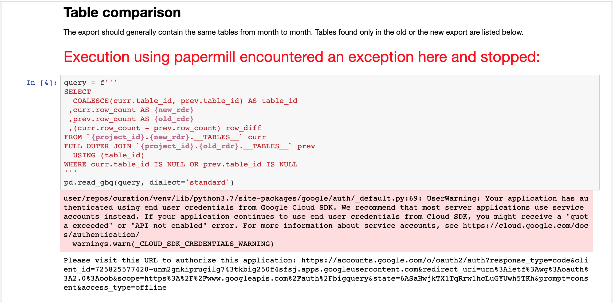

# CDR Ops

Notebooks for operational evaluation of data. 

# Running

Refer to `data_steward/notebooks/README.md`.

# Notebook Execution

>**<em>**Note: The `my_project_root/data_steward` directory must first be in the PYTHONPATH for the following to work.</em>**

  
Jupytext notebooks (.py extension) can be executed with supplied parameters and exported to an HTML document using the utility `report_runner.py`.

```
$ python report_runner.py -h
usage: report_runner.py [-h] [--output_path OUTPUT_PATH] [--help_notebook]
                        [--params PARAM_NAME PARAM_VALUE]
                        notebook_path

positional arguments:
  notebook_path         A .py jupytext file

optional arguments:
  -h, --help            show this help message and exit
  --output_path OUTPUT_PATH
                        An output .html file. If not provided, defaults to an
                        html path with name of [notebook path]
  --help_notebook       Lists the accepted parameters for [notebook_path]
  --params PARAM_NAME PARAM_VALUE, -p PARAM_NAME PARAM_VALUE
                        A parameter to pass to [notebook path] (multiple may
                        be provided)
```  

### Preparing Notebook Template

In order for an input notebook to accept parameters, it must be prepared in the special format described in the [papermill](https://papermill.readthedocs.io/en/latest/usage-parameterize.html) package documentation.  

Within an opened jupyter notebook, do the following:
1. Select the `View -> Cell Toolbar -> Tags` menu option to activate the notebook's tag view.
2. In a single cell, define 1 or more variables that will be your parameters.  
    1. An optional comment on a variable's line will serve as its description.
    1. An optional type hint can be provided. 
3. In your parameter-containing cell, enter the term **parameters** into the textbox adjacent to the <em>Add tag</em> button.
4. Click the <em>Add tag</em> button to mark the cell with the entered tag.


### Viewing Notebook Parameters

To view the parameters required for a particular notebook, the <em>--help_notebook</em> option can be passed to `report_runner.py`.

```
$ python report_runner.py "Example Notebook.py" --help_notebook
Parameters inferred for notebook Example Notebook:
2021-01-28 17:44:08 - INFO - papermill - Input Notebook:  Example Notebook.ipynb
  my_unknown_parameter: Unknown type (default "", required=True)
                                  This parameter has an unknown type.
  my_string_parameter: str (default "", required=True)
                                  This is a string parameter.
  my_int_parameter: int (default 0, required=False)
                                  This is an integer parameter.
```

### Running Notebook

When executing a notebook, each parameter is passed with a separate <em>-p</em> or <em>--parameters</em> flag.

```
$ python report_runner.py "Example Notebook.py"  
        --output_path executed_notebook.html  
         -p my_unknown_parameter "hello"  
         -p my_string_parameter "world"  
         -p my_int_parameter 6
Executing: 100%|█████████████████████████████████████████████████████| 3/3 [00:01<00:00,  2.11cell/s]
```
And the outputted html:


Notice that an extra cell containing the passed parameter values was injected into the notebook.

### Debugging

There are a few sets of errors one may encounter when attempting to execute a notebook.

#### Incomplete Path

To run this script, the `my_project_root/data_steward` directory must first be in the PYTHONPATH. If it is not, an error similar to the following may occur:

```
Traceback (most recent call last):
  File "report_runner.py", line 22, in <module>
    from utils import pipeline_logging
ModuleNotFoundError: No module named 'utils'
```

A simple fix is to export the PYTHONPATH manually, e.g.:

```
export PYTHONPATH="/path/to/my_project_root/data_steward"
```

#### Missing/Unknown Parameters

These errors occur when required parameters or values are not passed in or an unknown parameter is provided. A error message is logged and the notebook is not executed:

```
$ python report_runner.py "Example Notebook.py" 
    --output_path executed_notebook.html 
     -p my_unknown_parameter "hello"  
     -p my_int_parameter 6
Missing the parameter my_string_parameter for notebook Example Notebook
Parameters inferred for notebook Example Notebook:
  my_unknown_parameter: Unknown type (default "", required=True)
                                  This parameter has an unknown type.
  my_string_parameter: str (default "", required=True)
                                  This is a string parameter.
  my_int_parameter: int (default 0, required=False)
                                  This is an integer parameter.
```

#### Failed Notebook Logic

If an error occurs during the execution of the notebook cells, an error message will be logged <em>and</em> the error will be labeled in the resulting html file.

```
$ python report_runner.py "Example Notebook.py" --output_path executed_notebook.html -p my_unknown_parameter "hello" -p my_string_parameter "world" -p my_int_parameter 6
Executing: 100%|█████████████████████████████████████████████████████| 3/3 [00:01<00:00,  2.08cell/s]

---------------------------------------------------------------------------
Exception encountered at "In [3]":
---------------------------------------------------------------------------
TypeError                                 Traceback (most recent call last)
<ipython-input-3-6cf2cee3f746> in <module>()
      1 print(f"My unknown type parameter is {my_unknown_parameter}")
----> 2 print(f"My string parameter is {my_string_parameter / 0}")
      3 print(f"My int parameter is {my_int_parameter}")

TypeError: unsupported operand type(s) for /: 'str' and 'int'
```


##### Failed GCP Authentication

Failed Google Cloud Platform (GCP) authentication is a common error when executing notebooks for curation operations:



To remedy, export the `GOOGLE_APPLICATION_CREDENTIALS` environment variable with a path to valid credentials, e.g.:

```
export GOOGLE_APPLICATION_CREDENTIALS=/path/to/data-analytics.json
```


### More Info

To get more info on papermill, the package which this module heavily relies on, visit its [documentation](https://papermill.readthedocs.io/en/latest/).


  

