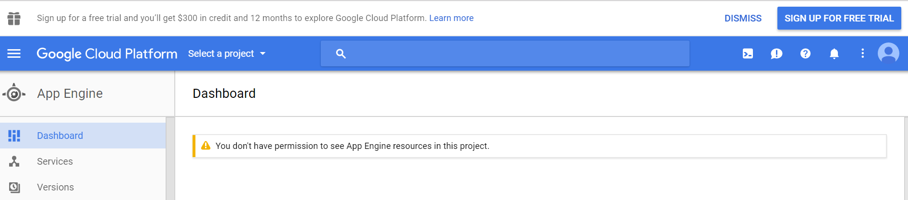
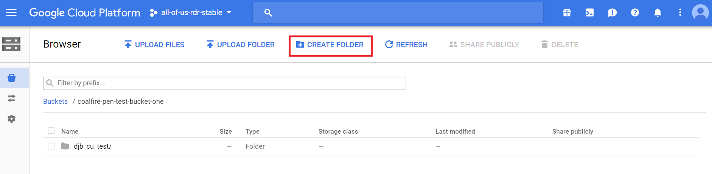
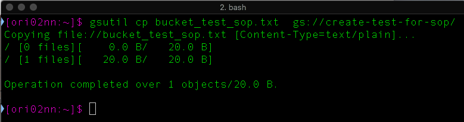

title: File Transfer Procedures
template: page

## DATA STEWARD REGISTRATION
This section is designed to outline the procedure for requesting creation of a Google Cloud Storage Bucket and identifying and registering an Organization’s Data Steward. The Google Cloud Storage Bucket is the place within the DRC system to which EHR data files will be uploaded. A Data Steward is the personnel who will upload Electronic Health Record (EHR) data files to the Data and Research Center (DRC) on behalf of their Organization. 

The process applies to all program partner organizations that are responsible for sharing participant data (e.g., EHR) with the DRC. This document details the steps required to request creation of a Bucket and to register a Data Steward with the DRC.

---
## KEYWORDS
   * __SOP:__ Standard Operating Procedure
   * __DRC:__ Data and Research Center
   * __EHR:__ Electronic Health Records
   * __Bucket:__ Location within Google Cloud Environment where a site's data is stored
   * __Data Steward:__ Individual at an organization responsible for uploading EHR data
---
## RESPONSIBILITY
Each Organization tasked with uploading EHR data files or other Participant data to the DRC is required to request creation of a Bucket and register personnel who will fulfil the Data Steward role. The Data Steward is an individual at an organization responsible for uploading EHR data to their organization’s specified bucket within the DRC. An organization may designate a maximum of two (2) Data Stewards at a time in order to ensure backup coverage.

Each Organization is responsible for notifying the DRC in a timely manner whenever de-provisioning of Bucket access for a Data Steward or the organization is necessary. De-provisioning or the unregistration of personnel designated as Data Steward or of an organization itself is completed by sending an email to sysadmin@pmi-ops.org. Data Steward(s) are responsible to adhere to the procedure outlined in this document.

---
## PROVISIONING

__Step 1:__ Request creation of pmi-ops.org account for Data Steward(s) by sending an email to sysadmin@pmi-ops.org with the subject   line “NEW USER REQUEST: Data Steward”. 

   The email should include the following:
   * Name and Contact (including institutional email)
   * Organization, Role, and Justification for Access
   * Signed copy of [DRC IT Rules of Behavior for Privileged Use](https://docs.google.com/document/d/1E6bRJ4l7AclEkaFS4Tg2zt9u3WyFMOpu4-omMjhlTRM). Note that the entire document must be attached, not just the signature page.
   * Attestation of completion of institutional general security training

If the bucket will have a Primary as well as a Secondary Data Steward, this should be noted in the new user request email. Requests should be sent separately; bundled new user access requests cannot be processed

1. Open a web browser and navigate to the Google Cloud Storage Browser at `https://console.cloud.google.com/storage/browser/<BUCKET_NAME>` but replace `<BUCKET_NAME>` with the bucket name assigned to your site. For example, if your site was assigned `test-site-bucket-aou-data-steward-nyc`, then it would be [https://console.cloud.google.com/storage/browser/test-site-bucket-aou-data-steward-nyc](https://console.cloud.google.com/storage/browser/test-site-bucket-aou-data-steward-nyc).
1. Enter your `pmi-ops.org` credentials if prompted.
1. In your desktop environment, navigate to the local folder where you've downloaded the test data set.
1. Drag and drop the test data set files from your local folder into the browser window where the Google Cloud Storage Browser is open.

   * Name of Organization that will perform the upload
   * Composition of data upload: Will data be uploaded for only one Organization or for multiple Organizations? If for more than one Organization, also include the names of all Organizations whose data will be uploaded.
   * Name, institutional email address, and pmi-ops.org account information of the Data Steward(s)

Within five business days you will receive a response from the sysadmin containing:

<<<<<<< 4f55f86f0836f914afa18dafc89ab6eaf3cd4d13
   * The name of your Organization’s assigned Google Cloud Storage Bucket
   * Direct link to aforementioned Bucket

__Note:__ You can concurrently send the pmi-ops.org account and the Bucket creation requests to sysadmin@pmi-ops.org. However, the request emails need to be separate for tracking purposes.

---

## DE-PROVISIONING
__Step 1:__  Request account to be de-provisioned by sending an email to sysadmin@pmi-ops.org with the subject line “Account De-Provision”.  Include the following information:
  * Name of Organization or Individual to be de-provisioned.
  * If it is an individual include a replacement contact.

---

## UPLOADING EHR DATA TO THE DRC
This part of the process steps through the procedure for uploading EHR data files to the Data and Research Center (DRC) Google Cloud Storage Buckets.The process applies to all program partner organizations that are responsible for sharing participant data (e.g., EHR) with the DRC.  It details the required documentation and parameters needed as well as the testing required to upload EHR data to the DRC Google Cloud Storage Buckets.

__Step 1:__ Log out of any currently active Google IDs. Log into MyAccount (https://myaccount.google.com/)  with the pmi-ops.org credentials provided by the DRC User Admin.

__Step 2:__ Data Stewards will receive an email from the DRC User Admin containing a direct link to the assigned Bucket. Open a web browser and navigate to the Google Cloud Storage Bucket via the direct link shared with you by the DRC User Admin. 

NOTE: If you receive the error message shown below, please check that the pmi-ops.org account is the active account. 

__Step 3:__ Create a folder within the Bucket. Data files for each upload cycle must be contained within a unique folder. Loose files uploaded to the bucket root will not be accepted. 

__Step 4:__ Uploading with gsutil
- Authenticate:Enter gcloud auth login
  - This opens a browser window to authenticate to Google Cloud Platform. Login using the assigned pmi-ops account (e.g. john.smith@pmi-ops.org)
 - Set project: gcloud config set project all-of-us-staging (for example)
 - Upload files: gsutil cp -r my-site-ehr-data-2017-05-20 gs://aou-ehr-test-awardee-site-123/
 - Upload

NOTE: for instructions on installing gsutil [click here](https://cloud.google.com/storage/docs/gsutil_install#sdk-install).

_The following is an alternative Upload Procedure to using gsutil_
 - In a desktop environment, navigate to the data set. Drag and drop the data set files from the local folder into the browser window where the Google Cloud Storage Browser is open to the folder created in Step 3 under Procedures.

__Step 5:__ Within 24 hours of uploading data to a folder within the Bucket, the [report page](https://storage.googleapis.com/test-aou-curation-spec-site-bucket/report.html) on the All of Us Upload website will display the sites uploaded tables with feedback on whether it was received or loaded. Review this status to verify that the upload was successful.  This website is also provided by the sysadmin in the setup of the pmi-ops account.

__Step 6:__ If any errors were detected in the data files uploaded to the Bucket, a detailed report will appear in the Bucket folder to which the files were uploaded. Navigate to the Bucket folder containing the recently uploaded data files and review the report. Resolve in the data files any errors identified and repeat steps 1-5 to reupload.

---

## ISSUE REPORTING
Report any issues with Bucket access or the upload process to sysadmin@pmi-ops.org. A member of the DRC team will contact the Data Steward to assist with resolution of the issue.

---

If you experience any issues in this prcoess, please report an issue on our [JIRA site](https://precisionmedicineinitiative.atlassian.net).
