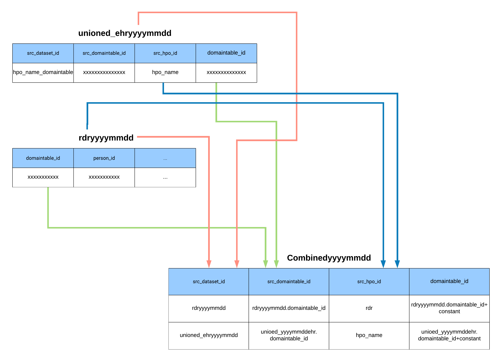

# Validation
 
Validate data sets that are submitted to the RDR. All endpoints are accessible only to specially provisioned service accounts.

## `GET /data_steward/v1/ValidateHpoFiles/<hpo_id>`
Loads the files from an HPOs bucket, validates them according to the spec, and generates a report. The report payload is 
a json file which is uploaded to the DRC bucket used to publish the spec. The json file is rendered in the report page 
on the specification document.

## In Progress

These scripts were originally developed to operate in a standard Python environment (for the "data sprints") and will
be ported to operate in GAE.    

### achilles

This will run an abbreviated version of Automated Characterization of Health Information at Large-scale Longitudinal 
Evidence Systems ([ACHILLES](http://www.ohdsi.org/analytic-tools/achilles-for-data-characterization/)). 
It creates and populates `ACHILLES_{analysis, results, results_derived, results_dist, HEEL_results}`, tables which 
help to characterize an OMOP CDM instance.

### webapi (in progress)

This will automate the backend configuration of 
[Atlas](http://www.ohdsi.org/web/wiki/doku.php?id=documentation:software:atlas), a tool which will be leveraged for more
robust data characterization and data quality analysis. It will populate `source` and `source_daimon` tables so Atlas can be 
used to analyze datasets created by [validation](#validation) and [achilles](#achilles).

### Mapping Architecture
Data lineage generated to the CDR tables uses the following structure.
