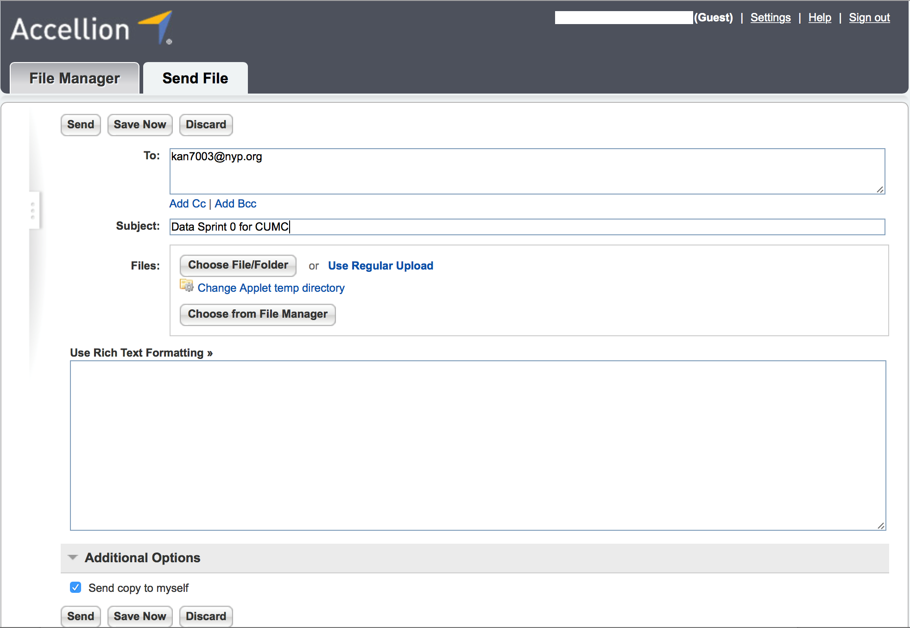

# File Transfer Procedures

This section will cover the file naming convention as well as the method of transmission for this data sprint. Each of the above tables will be exported to separate CSV file. The proposed naming convention will be:

    <hpo_id>_<table_name>_DataSprint_<data_sprint_number>.csv

The following abbreviations will be used for the HPO Names:

| Healthcare Provider Organization                                       | Abbreviation |
|------------------------------------------------------------------------|--------------|
| Columbia University MC/ Weill Cornell MC/Harlem Hospital HPO, NYC      | CUWMHH       |
| Illinois Precision Medicine Consortium                                 | IPMC         |
| University of Arizona, Tucson                                          | UAMC         |
| University of Pittsburgh at Pittsburgh                                 | PITT         |
| Cherokee Health Systems, Knoxville, Tennessee                          | CHS          |
| Community Health Center, Inc., Middletown, Connecticut                 | CHCI         |
| Eau Claire Cooperative Health Center, Columbia, South Carolina         | ECCHC        |
| HRHCare, Peekskill, New York                                           | HRHC         |
| Jackson-Hinds Comprehensive Health Center, Jackson, Mississippi        | JHCHC        |
| San Ysidro Health Center, San Ysidro, California                       | SYHC         |
| Veteran Affairs                                                        | VA           |
| Trans-American Consortium for the Health Care Systems Research Network | TACH         |
| New England Precision Medicine Consortium                              | NEC          |
| California Precision Medicine Consortium                               | CPMC         |
| Geisinger Health System                                                | GHS          |

So a file name for the person table export from Columbia would like this: 

    CUWMHH_Columbia_person_DataSprint_2.csv.
    
    If the file is from a site within an HPO, like Cornell within the Columbia HPO, the file name would look like this: 
    
    CUWMHH_Cornell_person_DataSprint_0.csv.

## File transmission

All files will be sent to Columbia University Medical Center (CUMC) via a secure file transfer portal (<https://transfer.nyp.org)>. In order to send files to CUMC, individuals must be registered with the system, which will be initiated via email. Each HPO identified one contact person who will participate in the data sprints. The below steps must be followed to setup an account

1. An email like the one below will be sent to the identified individuals. Click on the link in the email

    

1. After clicking the link, you will be redirected to the secure transfer portal to set up an account. Your email will be prepopulated, and you can setup a password. Please note this password because the email/password combination will be used for future data sprints.

    

1. For sending files, you will log into the portal and click on the ‘Send File’ tab. Please send the files to <kan7003@nyp.org> and address the subject line as “Data Sprint \[Data Sprint Number\] for \[HPO Name\]”. For example, a submission from CUWMHH for data sprint 0 would be: “Data Sprint 0 for CUWMHH”.

    

1. Attach the files to be submitted by clicking ‘Choose File/Folder’ or by clicking ‘Choose from File Manager’.
